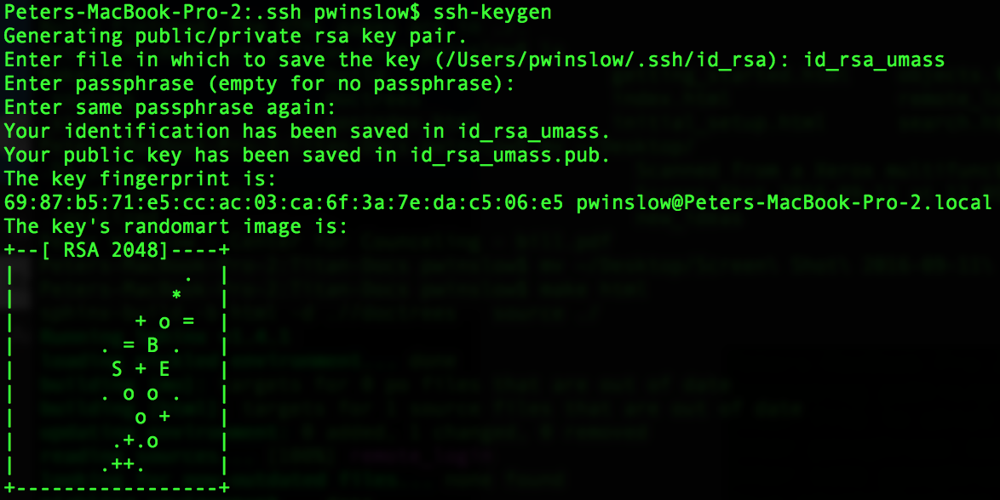

======================================
Getting Started
======================================

This section is designed to just help get you logged into the titan cluster. 

--------------------------------------
Logging In
--------------------------------------

The first step in working with titan is to contact `Joe <mailto:babcock@physics.umass.edu>`_ to request 

* a titan account as a member of the ACFI theory group
* a space on the /data2 disk (as far as I know, this is the most stable disk for analysis)

In the request, you should include your preferred username. Once your account is created, you'll receive a temporary password. In order to change this to a password of your own choice, you'll need to log onto titan. To do this, first make sure you are logged onto the Physics wifi network [#]_. Then open a terminal [#]_ and type the following ::

	ssh username@titan.physics.umass.edu

where username should be replaced by your chosen username. If this is your first time logging into titan, you will most likely see the following warning ::

	The authenticity of host XXX.XXX.X.XXX (XXX.XXX.X.XXX) cannot be established. RSA key fingerprint is XX:XX:XX:XX:XX:XX:XX:XX:XX:XX:XX:XX:XX:XX:XX:XX. Are you sure you want to continue connecting (yes/no)?

This warning can safely be ignored. Just type yes, press enter, and you should then be logged into titan. In order to change your password, type the following ::

	passwd

This will first prompt you for your current password (your temporary password) and then for your preferred password. Once that's done, you should then give your preferred password whenever you log into titan via the ssh command above. 

While in titan, you will be forced to use the terminal for everything. If you aren't familiar with the unix terminal utility and what you can do with it, `this <https://community.linuxmint.com/tutorial/view/244>`_ is a handy reference but google is likely your best friend here.

.. _remote-login:

--------------------------------------
Remote Login
--------------------------------------

If you are away from the ACFI or can't login into the Physics wifi network, then there is a backdoor method for logging into titan. This consists of first logging into a server which is already onsite at LGRT called stepa0 and then, from there, logging into titan. To log onto stepa0, open a terminal and type ::

	ssh everybody@stepa0.physics.umass.edu

When prompted for a password, use **406Amherst**. Once into the remote server, then log into titan the standard way. 

--------------------------------------
Automatic Login (Optional)
--------------------------------------

Logging into stepa0 first and then titan from there can get annoying after a little while with all the typing. In order to simplify the process somewhat, you can setup an automatic logins. To do this, open a terminal on your local machine and cd into your **~/.ssh** folder. Here, you can create a public/private rsa key pair by typing ::

	ssh-keygen

It will then give you the prompt: *Enter file in which to save the key*. I recommend choosing a convenient filename here, such as **id_rsa_umass**. You'll then be prompted for a passphrase. Just press enter without writing anything (no passphrase is assigned). This isn't needed as long as you're careful with your own local machine and it also allows you to call ssh from within a shell script. If this was successful, you should see something resembling the following

This process will create two files, **id_rsa_umass** and **id_rsa_umass.pub**. While still in the **~/.ssh** folder, open the config file with your favorite text editor (if no config file exists yet, just create it) and write the following lines at the end of it ::

	Host everybody
   		User everybody
   		Hostname stepa0.physics.umass.edu
   		IdentityFile ~/.ssh/id_rsa_umass
   		ServerAliveInterval 10

and save and close it. You now need to copy the public key to the remote host. To do this, type ::

	scp id_rsa_umass.pub everybody@stepa0.physics.umass.edu:~/.ssh/

using the above password when prompted and then ssh into stepa0 and cd into **~/.ssh**. You should now see your id_rsa_umass.pub key as well as an **authorized_keys2** file. In order to insert your public key into the list of authorized keys, type ::

	cat id_rsa_umass.pub >> authorized_keys2

We can now further simplify the step into titan by adding the following lines to the **config** file in the **~/.ssh** folder ::

	Host titan
		User username
		Hostname titan.physics.umass.edu

with **username** replaced with your chosen titan username. 

If you now start a new terminal on your local machine, you should be able to simply type ::

	ssh everybody

to get into stepa0 without a password from your local machine. Once there, you should be to type ::

	ssh titan

to log into titan, after you insert your titan password when prompted. 

**Note:** *it's possible to repeat the procedure to log into stepa0 without a password for titan as well. However, in the interest of security, I'd recommend against this.*

.. [#] If you haven't gotten access to this network yet, the network is down (it happens...), or you're currently not at the ACFI go to :ref:`remote-login`. 
.. [#] In OSX, this is in your Applications/Utilities folder. For PC users, I would recommend installing `ubuntu <http://www.ubuntu.com/>`_ alongside windows either as a dual boot or installation within windows.